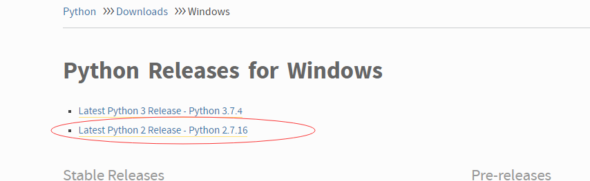
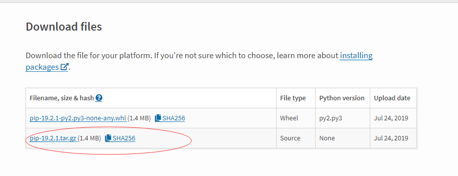
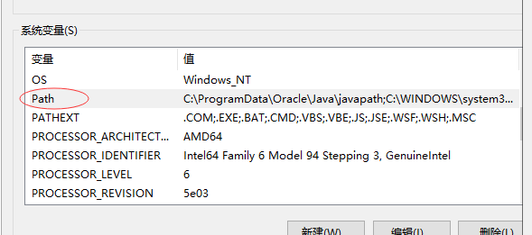
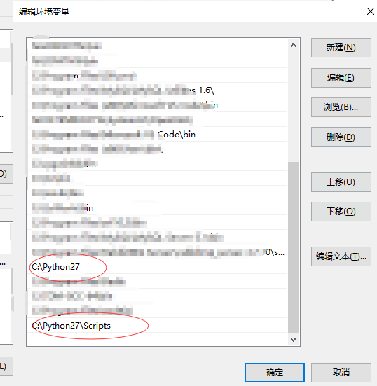
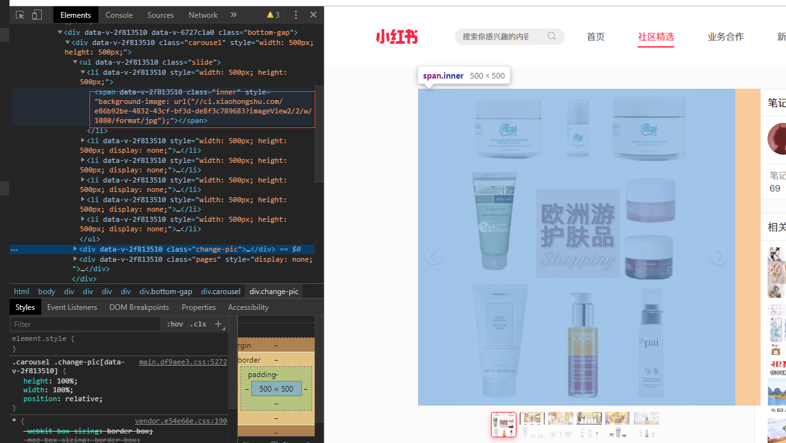
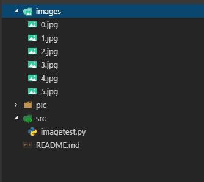
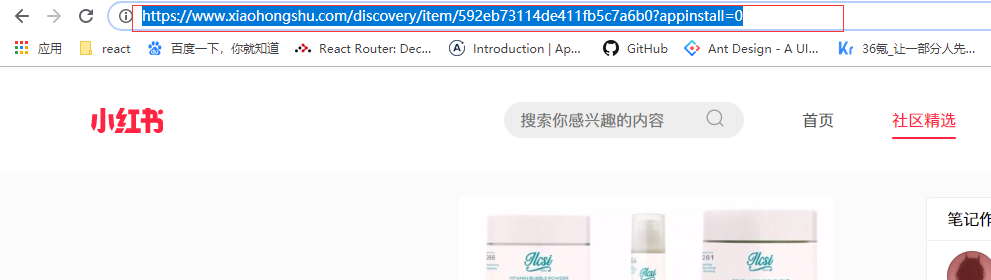
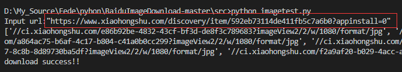
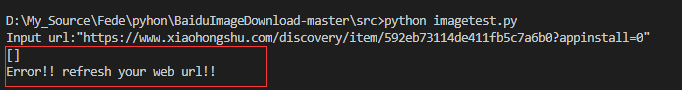

## python 小红书的图片爬虫 下载到本地 无水印
-----

### 搭建python环境 window
1. 下载**Python** https://www.python.org/downloads/windows/
 
    

3. 下载包管理工具 **pip** https://pypi.org/project/pip/#files (Python 2.7.9 + 或 Python 3.4+ 以上版本都自带 pip 工具。)
   
    

4. 配置环境变量 如图 注意要配置python的Script目录才可以在控制台使用pip
   
    

    

### 开始码代码

1. 使用pip下载包
    - urllib
    - requests
   
2. 首先要获取html页面信息  
   - **使用Urllib 模块提供了读取web页面数据的接口，我们可以像读取本地文件一样读取www和ftp上的数据。**
  
        ```python
        def getHtml(url):
            page=urllib.urlopen(url)
            html=page.read()
            return html
        ```
3. 获取图片 下载到本地
   - 首先打开页面的开发者模式 查看元素 找出要抓取的信息 根据信息写正则表达式 

     

        ```python
        def getImg(html)
            reg = r'style="background-image:url\((\/\/.+?)\)\;"'  
            imgre = re.compile(reg)
            #读取html中符合我们正则表达式的数据
            imglist = re.findall(imgre,html)
        ```
    
   - 循环访问图片地址保存到本地
   
        ```python
        def getImg(html)
            x= 0
            for imgurl in imglist:
                try:
                    pic = requests.get("http:" + imgurl, timeout=10)
                except requests.exceptions.ConnectionError:
                    print('error！！')
                    continue
                dir = '../images/'+ str(x) + '.jpg'
                fp = open(dir, 'wb')
                fp.write(pic.content)
                fp.close()
                x += 1
        ```
1. 最终代码
   
    ```python
    #coding=utf-8
    import re
    import urllib
    import requests

    #获取页面信息
    def getHtml(url):
        #Urllib 模块提供了读取web页面数据的接口，我们可以像读取本地文件一样读取www和ftp上的数据。
        page=urllib.urlopen(url)
        html=page.read()
        return html

    #获取图片并下载
    def getImg(html):
        #正则筛选信息 下面的正则是根据小红书自己定义的 如果要抓取其他的 要自行根据规则修改
        reg = r'style="background-image:url\((\/\/.+?)\)\;"'  
        imgre = re.compile(reg)
        #读取html中符合我们正则表达式的数据
        imglist = re.findall(imgre,html)
        print imglist
        #循环访问图片地址保存到本地
        x= 0
        for imgurl in imglist:
        
            try:
                pic = requests.get("http:" + imgurl, timeout=10)

            except requests.exceptions.ConnectionError:
                print('error！！')
                continue
            dir = '../images/'+ str(x) + '.jpg'
            fp = open(dir, 'wb')
            fp.write(pic.content)
            fp.close()
            x += 1

        if len(imglist) > 0 :
            print ('download success!!')
        else :
            print ('Error!! refresh your web url!!')
        
    # 例如输入=》"https://www.xiaohongshu.com/discovery/item/592eb73114de411fb5c7a6b0?appinstall=0"  记住输入时要带双引号
    url = input('Input url:')

    html = getHtml(url)  

    getImg(html)
    ```
1. 目录结构  下载的图片放在images
   
   

2. 运行 命令行进入src目录执行 `python imagetest.py`

    **注意输入你要抓取的地址时要加双引号如图**
   
   
   
   下载成功如下显示：
   
   

3. 运行错误解决:
   - 如果运行信息出现如下错误

     

   - 重新刷新下地址就好 因为小红书有个验证 过了一定日期就要手动验证下才能访问地址
      
      
      
      重新运行即可

1. 效果图
   
   
    
